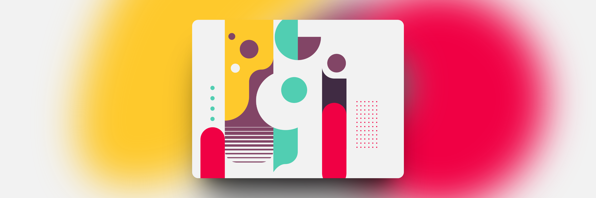

# Online Resources

This is my personal list of free (or paid and free) online resources, such as illustrations, icons, fonts and tools. Feel free to add links and other resources.

## Table of content

- [Illustrations](#illustrations)
- [icons](#icons)
- [Fonts](#fonts)
- [Stock Images](#stock-images)
- [Color Palettes](#color-palettes)
- [Utility and Tools](#utility-and-tools)
- [Javascript](#javascript)

## Illustrations

- [Invision App](https://www.invisionapp.com/free-resources): Free Design Resources

- [Icons8](https://icons8.com/): Icons, illustrations, photos, music, and design tools
 
- [UnDraw](https://undraw.co/): Illustrations

- [Paaatterns](https://products.ls.graphics/paaatterns/): Svg and Png geometrical patterns

- [ManyPixel](https://www.manypixels.co/gallery): Illustrations and Icons

- [Drawkit](https://www.drawkit.com/): Illustrations (2D, 3D, animated) and Icons

- [Humaaans](https://www.humaaans.com): Illustrations

- [Avaaatars](https://avataaars.com/): avatars gallery

- [Reshot](https://www.reshot.com/free-vector-illustrations/): Free Illustrations

- [Blush](https://blush.design/it): Free Illustrations (customizable)

- [OpenDoodles](https://www.opendoodles.com/): Free doodles and illustrations

- [OpenPeeps](https://www.openpeeps.com/): Hand drawn illustrations

- [FreeIllustrations](https://lukaszadam.com/illustrations): Free Illustrations

- [Handz](https://www.handz.design/): Free collections of 3D hands

- ~~[Ouch (icons8)](https://icons8.com/illustrations): Illustrations 2D and 3D (not free)~~

## Icons

- [Font Awesome](https://fontawesome.com/)
- [Bootstrap Icons](https://icons.getbootstrap.com/)
- [Material Symbols](https://fonts.google.com/icons)

## Fonts

- [Google Fonts](https://fonts.google.com/)
- [Awwwards Collections](https://www.awwwards.com/awwwards/collections/free-fonts/)
- [Fonts](https://www.fonts.com/)

## Stock Images

- [Unsplash](https://unsplash.com/)
- [Pexels](https://pexels.com/)
- [Moose (Icons8)](https://icons8.com/photos)

## Color Palettes

- [Coolors](https://coolors.co/)
- [ColorHunt](https://colorhunt.co/)
- [Canva Colors](https://www.canva.com/colors/)

## Utility and Tools

- [PaperSize](https://papersizes.io/): comprehensive resource listing of all paper sizes, dimensions, and formats.

- [Box Shadow Generator](https://shadows.brumm.af/)

- [Cubic Bezier Generator](https://cubic-bezier.com/)

- [Grid Layout generator](https://grid.layoutit.com/)

- [Haikei](https://haikei.app/): design assets generators (blob, curves, waves, ...)

- [Tabbied](https://tabbied.com/): Random background pattern generator

- [MeshGradient](https://meshgradient.in/): Generate mesh gradients

- [Shots](https://shots.so/): create beautiful mockup

- [100L5](https://10015.io/): a list of useful online tools

## Javascript

- [AnimXYZ](https://animxyz.com/): Generatore di animazioni

- [Animate on scroll](https://michalsnik.github.io/aos/)