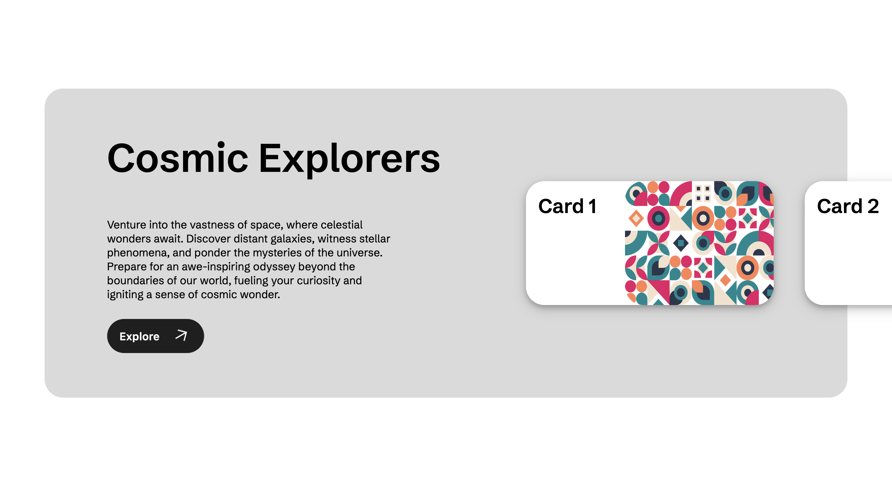

# Templates

This is how I would implement the following templates. I'm not sure if it's the best way to do it, so I welcome feedback, suggestions, and pull requests.

(The text used in these examples is written by AI so it may be weird)

**All templates are fully responsive** (at least i'll try).

## Template 1

  

  <a href="../Templates/T1/">Source code</a> 
  This template shows a title, subtitle and a button on the left side of the page with an svg image on the right.
   
  <b>Responsive</b>: ✅
  
  

  

    
  

## Template 2

  

  <a href="../Templates/T2/">Source code</a> 
  This template is similar to the first one but with image and text in the opposite position
     
  <b>Responsive</b>: ✅
  

  

    
  

## Template 3

  

  <a href="../Templates/T3/">Source code</a> 
  This template shows 3 images with titles and subtitles
     
  <b>Responsive</b>: ✅
  

  

    
  

## Template 4

  

  <a href="../Templates/T4/">Source code</a> 
  This template shows 6 images with titles and subtitles like in a grid
     
  <b>Responsive</b>: ✅
  

  

    
  

## Template 5

  

  <a href="../Templates/T5/">Source code</a> 
  This template shows a centered image with title and subtitle
     
  <b>Responsive</b>: ✅
  

  

    
  

## Template 6

  

  <a href="../Templates/T6/">Source code</a> 
  This template is similar to te fifth but with image and title in opposite positions
     
  <b>Responsive</b>: ✅
  

  

    
  

## Template 7

  

  <a href="../Templates/T7/">Source code</a> 
  This template shows title and subtitle on the left and an horizontal card slider on the right (a little buggy)
     
  <b>Responsive</b>: ❌
  

  

    
  

